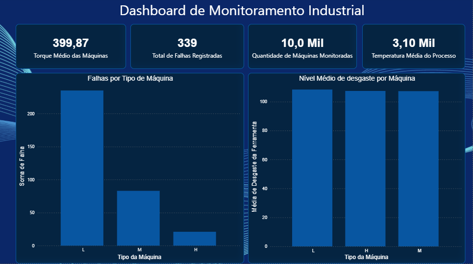
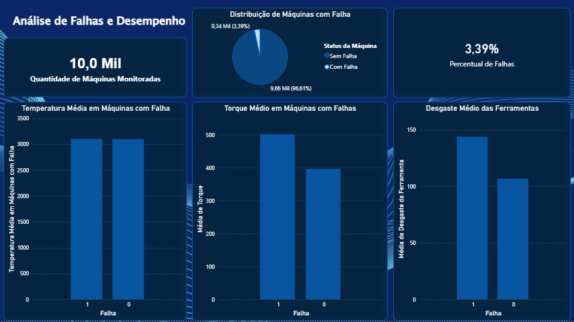

# SmartOps Analytics

Esse projeto foi feito por mim para praticar análise de dados usando Python, SQL e Power BI. Escolhi trabalhar com dados industriais porque achei interessante entender como as informações de uma máquina — temperatura, torque, desgaste podem indicar quando ela vai falhar.

Foi meu primeiro projeto do zero, sem seguir um tutorial passo a passo. O maior desafio foi organizar os dados antes de analisar e entender quais colunas realmente importavam para a análise.


## Ferramentas utilizadas

- Python (pandas, matplotlib)
- SQL
- Power BI


## Organização do projeto

```
SmartOps_analytics/
├── dados/
│   ├── brutos/              # Dataset original, sem alterações
│   └── tratados/            # Dataset após a limpeza
├── imagens/                 # Prints do dashboard
├── powerbi/                 # Arquivo do dashboard (.pbix)
├── python/
│   ├── limpeza_dados.py     # Limpeza e preparação dos dados
│   └── analise.py           # Análise exploratória e gráficos
├── sql/
│   ├── criar_tabelas.sql    # Estrutura da tabela no banco
│   └── consultas.sql        # Consultas para análise
├── requirements.txt
└── README.md
```

## Como executar

1. Clone o repositório ou baixe os arquivos

2. Instale as dependências:
```bash
pip install -r requirements.txt
```

3. Execute a limpeza dos dados:
```bash
python python/limpeza_dados.py
```

4. Execute a análise:
```bash
python python/analise.py
```

> O script de limpeza precisa rodar antes da análise, porque ele gera o arquivo `manutencao_tratada.csv` que a análise usa.


## O que foi feito

**Limpeza dos dados**
- Selecionei apenas as colunas relevantes para a análise
- Renomeei as colunas para nomes mais simples e padronizados
- Verifiquei e removi valores nulos
- Salvei o dataset tratado em uma pasta separada

**Análise exploratória**
- Quantidade total de registros
- Quantidade de falhas
- Média de torque e temperatura do processo
- Distribuição por tipo de máquina

**SQL**
- Criei a estrutura da tabela no banco de dados
- Escrevi consultas para as principais análises (médias, contagens, agrupamentos)

**Dashboard no Power BI**
- Visão geral dos dados
- Análise de falhas por tipo de máquina


## Algumas análises feitas

- Quantidade de falhas por tipo de máquina
- Média de temperatura das máquinas
- Relação entre desgaste e falhas
- Comparação de torque entre equipamentos


## Dashboard






## O que eu aprendi

Aprendi que grande parte do trabalho em análise de dados é a preparação — entender o dataset, escolher o que usar e deixar os dados organizados antes de qualquer análise. Também pratiquei como Python e SQL podem ser usados juntos em um mesmo projeto.


## Observação

Projeto desenvolvido para aprendizado e prática na área de dados. O dataset utilizado é público e pode ser encontrado no Kaggle (AI4I 2020 Predictive Maintenance Dataset).